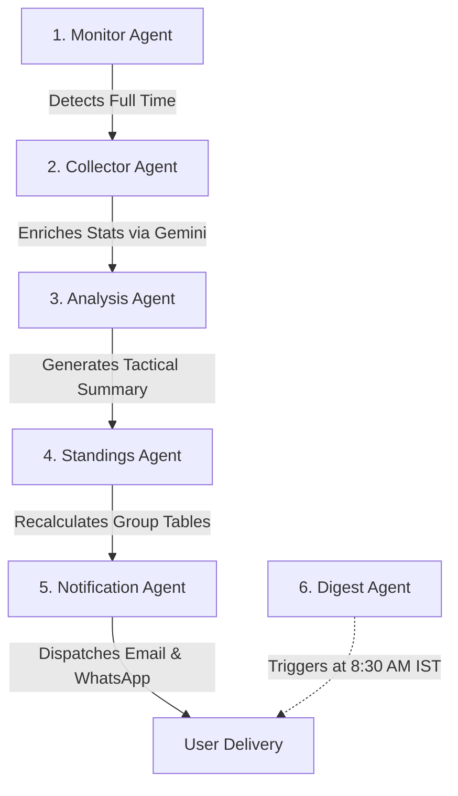

# ScoreSnap AI ⚽🤖
> **Sleep Through The Match, Wake Up Informed.**

ScoreSnap AI is a production-ready, zero-cost agentic football assistant for the **FIFA World Cup 2026**. It automatically monitors match schedules, simulates details (when APIs are unavailable), generates rich multi-lingual tactical summaries using Google Gemini, and delivers personalized alerts directly to users via **Email (Resend)** and **WhatsApp (CallMeBot)**.

---

## 🏗️ Architecture & Agentic Pipeline

ScoreSnap AI utilizes a serial pipeline of 6 specialized background agents to process completed matches duplicate-free:



1. **Monitor Agent**: Constantly monitors fixture schedules, updates match status (Scheduled -> Live -> Completed), and coordinates the downstream pipeline.
2. **Collector Agent**: Gathers core statistics (possession, shots on target, pass accuracy) using Gemini 1.5 Flash.
3. **Analysis Agent**: Synthesizes match summaries, tactical insights, turning points, and nominates a Player of the Match in the user's preferred language.
4. **Standings Agent**: Updates tournament points, wins, losses, goals, and goal difference in real time.
5. **Notification Agent**: Resolves duplicate checking against `EmailLog` records and dispatches alerts via Resend (email) and CallMeBot (WhatsApp).
6. **Daily Digest Agent**: Runs every morning (8:30 AM IST) to compile overnight results into a summary brief.

---

## 🛠️ Technology Stack

* **Backend**: FastAPI (Python), SQLAlchemy ORM, SQLite (Local Dev) / Neon PostgreSQL (Production), Google Gemini API, APScheduler.
* **Frontend**: React (Vite), Tailwind CSS v3, Framer Motion (for spring transitions and Dynamic Island), Lucide Icons, Axios.
* **Notification API Channels**: Resend (Email), CallMeBot (WhatsApp Bot).
* **Automation**: GitHub Actions (Free cron execution).

---

## ⚙️ Environment Variables

Create a `.env` file inside the `backend` directory. Refer to `backend/.env.example` for details:

```env
GEMINI_API_KEY=AIzaSy...              # Free Gemini Key from Google AI Studio
RESEND_API_KEY=re_...                 # Free Resend Email API Key
FROM_EMAIL=onboarding@resend.dev      # Resend verification address
DATABASE_URL=postgresql://...         # Neon DB connection URL (optional)
JWT_SECRET_KEY=yoursecretkeyhere     # JWT token signing secret
```

---

## 💻 Local Development Setup

### 1. Run the Backend (FastAPI)
```bash
cd backend
python -m venv venv
# Windows:
.\venv\Scripts\activate
# macOS/Linux:
source venv/bin/activate

pip install -r requirements.txt
# Run local uvicorn server (automatically seeds SQLite tables on start)
uvicorn main:app --reload --port 8000
```
* The API will boot on `http://localhost:8000` with Swagger docs available at `/docs`.

### 2. Run the Frontend (Vite + React)
```bash
cd frontend
npm install
npm run dev
```
* Open `http://localhost:5173` in your browser.

---

## 🚀 Zero-Cost Cloud Deployment Guide

### 1. Database (Neon PostgreSQL Free Tier)
1. Register on [Neon](https://neon.tech/) and create a free PostgreSQL database.
2. Copy the connection string and set it as `DATABASE_URL` in your backend environments.

### 2. Backend (Render Free Tier)
1. Link your GitHub repository to [Render](https://render.com/).
2. Create a new **Web Service**, select **Python** runtime, and configure:
   * **Start Command**: `uvicorn main:app --host 0.0.0.0 --port $PORT`
3. Add your environment variables in the Render Dashboard (Gemini key, database URL, etc.).

### 3. Frontend (Vercel Free Tier)
1. Link your repository to [Vercel](https://vercel.com/).
2. Set build settings:
   * **Build Command**: `npm run build`
   * **Output Directory**: `dist`
3. Add a configuration variable `VITE_API_URL` pointing to your hosted Render backend (e.g. `https://your-backend.onrender.com/api`).

### 4. Background Automation (GitHub Actions Cron)
The file `.github/workflows/cron.yml` is configured to run every 15 minutes. It pings your Render backend, ensuring it stays active and checks for match completions completely for free.
* Update the URL inside `.github/workflows/cron.yml` with your deployed Render backend address.
